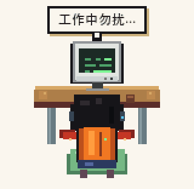

# Pixel Agent

Pixel Agent is a native macOS desktop companion for Codex. It lives in the menu bar, shows a small transparent pixel character on the desktop, and reacts to Codex activity through local hooks.

The character is a tiny pixel version of Codex sitting at a computer. It idles, works, thinks while tools run, waves when a task finishes, and occasionally gets sleepy or starts playing a tiny game when nothing is happening.

## Preview

| Idle | Working | Tool Active |
| --- | --- | --- |
|  |  |  |

| Completed | Sleepy | Gaming |
| --- | --- | --- |
|  |  |  |

## Features

- Native macOS app built with SwiftUI and AppKit.
- Menu bar resident app with a transparent floating desktop panel.
- Draggable character window with saved position.
- Optional position lock and animation pause.
- Three-finger drag support on trackpads.
- Click reaction: the character says "干嘛？".
- Codex process detection: shows automatically while Codex is running.
- Codex hook integration for status-driven animations.
- Idle variants: sleepy mode and gaming mode appear randomly after inactivity.
- Local-only event bridge; no network calls at runtime.
- Pixel sprite atlas rendering with nearest-neighbor scaling.

## Animation States

| State | Trigger | Behavior |
| --- | --- | --- |
| Idle | Codex is open, no active task | Calm computer pose |
| Working | User submits a prompt | Typing animation with "工作中勿扰..." bubble |
| Tool Active | Tool execution or permission request | Thinking/tool activity animation |
| Completed | Codex finishes a turn | Wave animation, then returns to idle |
| Sleepy | Idle for a while | Sleep animation with "瞌睡..." bubble |
| Gaming | Idle for a while | Tiny Snake or Tetris-style screen animation |

## Requirements

- macOS 14 or later
- Swift 6 toolchain
- Python 3, used by the Codex hook script and sprite generator
- Codex desktop app or Codex CLI hooks if you want live status sync

## Run Locally

Build and launch the app bundle:

```bash
./script/build_and_run.sh
```

Verify the app starts:

```bash
./script/build_and_run.sh --verify
```

Stream runtime logs:

```bash
./script/build_and_run.sh --logs
```

The generated app bundle is written to:

```text
dist/PixelAgent.app
```

## Menu Bar

After launch, look for `PX` in the macOS menu bar.

Available menu actions:

- Show or hide Pixel Agent
- Lock Position
- Pause Animation
- Start at Login
- Install Codex Hooks
- Uninstall Hooks
- Debug: Work
- Debug: Complete
- Debug: Sleepy
- Debug: Gaming
- Quit

## Codex Hooks

Pixel Agent uses Codex hooks as a local status bridge. When hooks are installed, the hook script appends sanitized JSON lines to:

```text
~/Library/Application Support/PixelAgent/events.jsonl
```

The app watches this file and updates the character state.

Supported Codex lifecycle mapping:

| Hook event | Pixel Agent state |
| --- | --- |
| `SessionStart` | `idle` |
| `UserPromptSubmit` | `working` |
| `PreToolUse` | `toolActive` |
| `PermissionRequest` | `toolActive` |
| `PostToolUse` | `working` |
| `Stop` | `completed` |

Hook installation is done from the `PX` menu. Pixel Agent backs up the existing Codex hooks file before changing it:

```text
~/.codex/hooks.json
```

More detail is documented in [docs/hook-contract.md](docs/hook-contract.md).

## Privacy

The hook script intentionally drops content-bearing fields such as prompts, tool input, and assistant messages. It only records status metadata:

- `timestamp`
- `hookEventName`
- `sessionId`
- `turnId`
- `toolName`
- `source`

Pixel Agent does not call external network services at runtime.

## Development

Run tests:

```bash
swift test
```

Build only:

```bash
swift build --product PixelAgent
```

Regenerate the pixel sprite atlas:

```bash
python3 tools/generate_sprite_atlas.py
```

Regenerate the README preview GIFs:

```bash
python3 tools/generate_readme_gifs.py
```

The sprite assets are stored in:

```text
Sources/PixelAgent/Resources/Assets/
```

## Project Layout

```text
Sources/PixelAgent/             macOS app, menu bar, panel, services, views
Sources/PixelAgentCore/         shared event and state mapping logic
Tests/PixelAgentTests/          unit and hook script tests
docs/hook-contract.md           hook event contract and privacy notes
script/build_and_run.sh         local build, bundle, launch, and log helper
scripts/pixel_agent_hook.py     standalone hook script copy
tools/generate_sprite_atlas.py  procedural pixel sprite generator
tools/generate_readme_gifs.py   README animation preview generator
```

## Repository

GitHub: [yangr8640-eng/pixel-agent](https://github.com/yangr8640-eng/pixel-agent)
